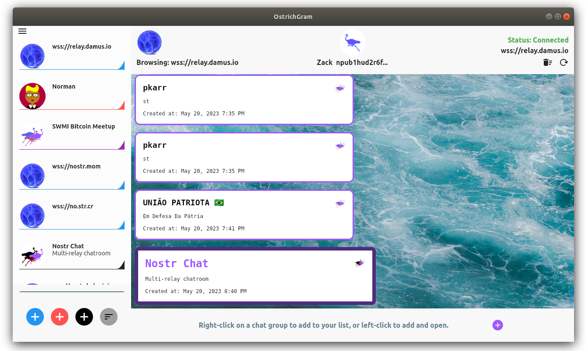
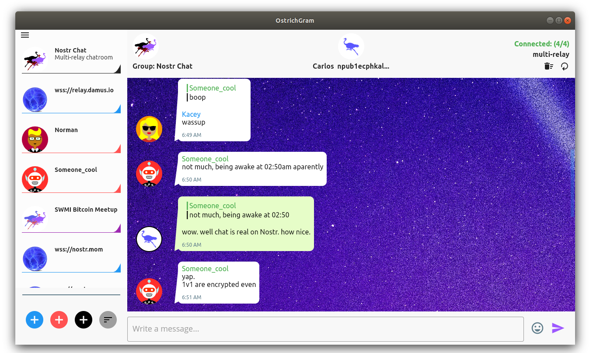

# OstrichGram Offers Multi-Relay Chat AKA "Fat Groups"

Decentralized chat can be great, but only if it's reliable. Multiple relays can make chatgroups ("channels") more robust and reliable. On that note, OstrichGram releases version 0.4 which supports multi-relay chat on Nostr. We have nicknamed this new kind of chatroom a "Fat Group".

# NIP-28

According to NIP-28, the proper way to indicate relays is to specify them using e-tags in the kind-41 metadata message referencing the kind-40 chatgroup. Multiple e-tags should be used; once for each relay in the chat. While NIP-28 does not (yet) give a specific example of multiple relays, it shows a single tag referencing a single relay, and therefore we can simply use multiple e-tags and conform to the Nostr specs.

# OstrichGram recognizes Fat Groups

When there is at least such e-tag, OstrichGram will mark the group as a "Fat Group" as opposed to a normal group.  Groups and Fatgroups look differently visually.  When browsing a relay, the fatgroup box will be slightly larger with a thicker, darker, border, and the icon for a fatgroup. 

# Fat Group Creation

You can create a FatGroup independently of browsing relays, by pushing the black button on the left.  The Fat Group icon also is different from a Group in the left panel, featuring a darker Ostrich icon.

# Chat Experience

The top panel will keep you informed of how many relays are in the fat group and how many are currently connected. The messages are cached and watermarked independently with each relay, and de-duplicated for storage. You can reconnect to all relays with the reload icon. There's also an trashcan icon to delete the cache. OstrichGram is designed to "listen to all, post to all" for maximum redundancy.

  
 
