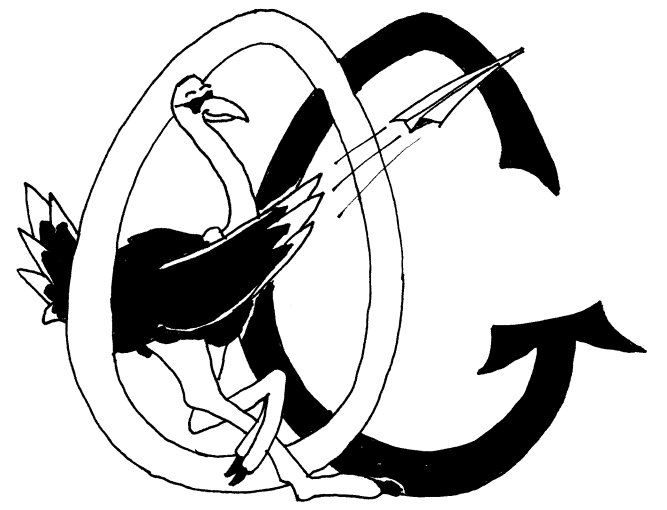
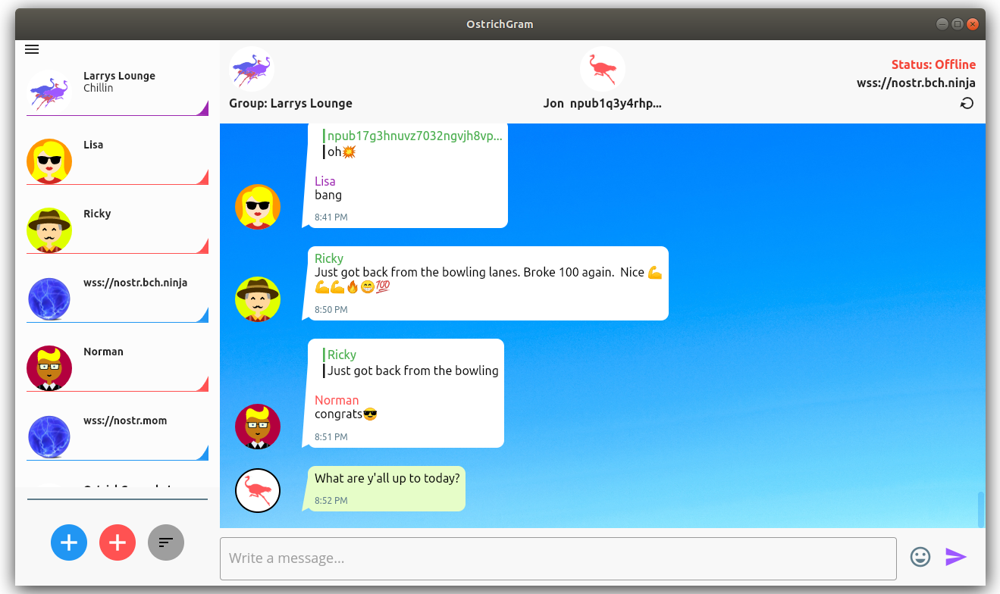
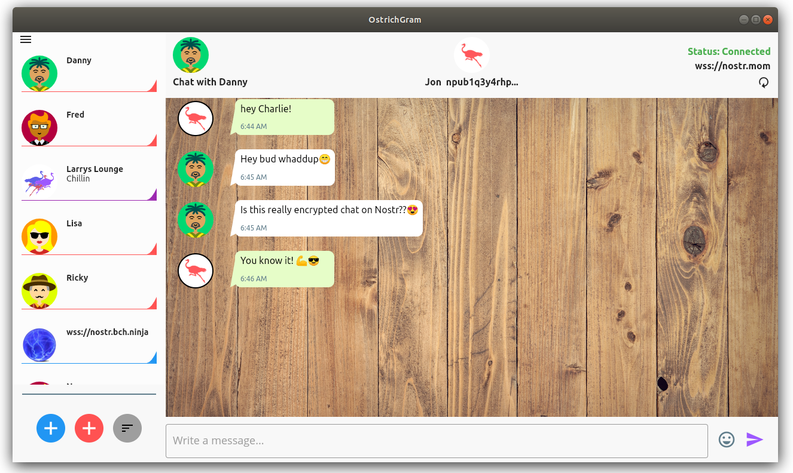
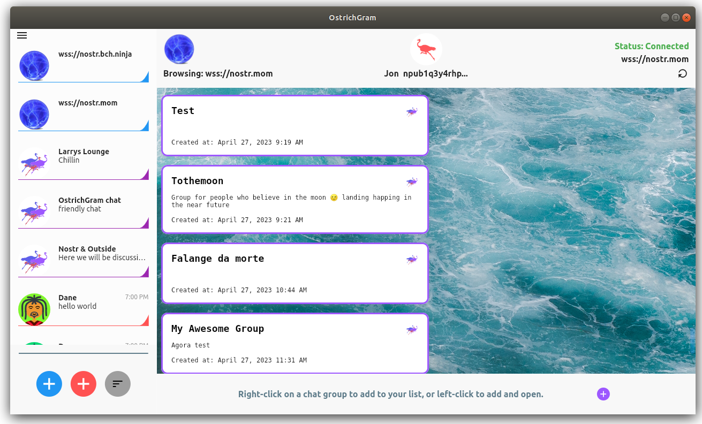
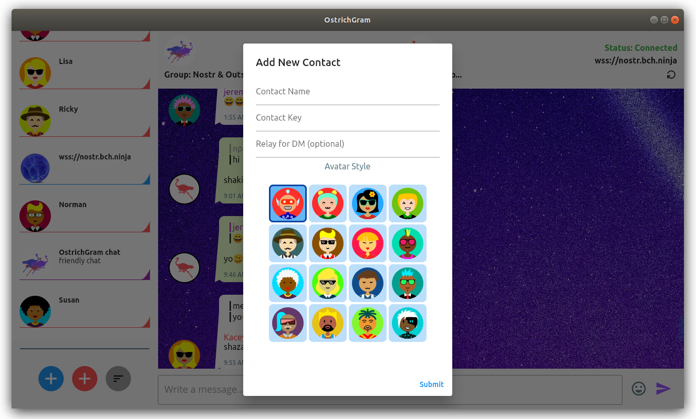

# OstrichGram

Welcome to OstrichGram, a chat software for the Nostr network.  With OstrichGram, you can join group chatrooms on Nostr, and message your friends too.

# Warnings

If you're new to Nostr, be forewarned: there is often no "delete button".  Although the nostr protocol has a "request to remove" feature, it is not implemented widely yet, and there is no guarantee all relays support it.  OstrichGram doesn't have a delete messages feature.  In general, Nostr is decentralized. It's an open protocol, and there's no company to call to ask for help. Please use Nostr and OstrichGram carefully and not for anything sensitive, embarrasing, or otherwise harmful.  

Open source software like OstrichGram may potentially have bugs and comes with "no warranty of merchantibility" under its license.  The early releases of OstrichGram are considered "Beta" software because they haven't been widely tested yet. Use carefully on your own discretion.

# Overview & Features
 
 With OstrichGram, you can create your own keys and identities, store your friends' pubkeys, browse relays for chatrooms, participate in group chats, and send direct encrypted messages to your friends. That's it in a nutshell. It uses NIP-01 (the basic protocol) along with NIP-28 (group chats), NIP-04 (direct messages), and NIP-10 (replies).
 
 # Screenshots

 
# Some Details and Considerations

OstrichGram has a primary websocket connection that it manages and only has one connection open at a time.  There is a content manager that runs on a timer to keep up with caching messages other than the active window, but that is only partially implemented, so at this time, it's just one connection to one relay at a time. Eventually and ideally in Nostr, chatrooms are distributed and redundant, but we will leave that for a future version.

Each contact (friend) has a field you can fill out to specify which relay you are chatting with them on.  It is recommended to use a single relay per friend and don't change it, as the older messages may not show up, although in theory, OstrichGram's caching system is supposed to still store the old messages.
 
In general, OstrichGram has a caching feature, but it is a basic implementation meant to show old messages if the user is offline.  It is not yet a timestamp based caching system, which will be needed in the future for larger sets of data. 

OstrichGram comes with some saftey features -- there are size limits on the number of events fetched, the size of events, and the size of the overload payload you can download from a websocket.  In the future these will be customizable.
 
OstrichGram is new software, and many relays are spotty, so don't expect the experience to be as smooth as a centralized service.

# Avatars

OstrichGram uses the multiAvatar library and creates determinstic avatars for every npub key, giving each user a unique looking icon. In OstrichGram, you can custom the avatars for your friends by choosing one of the 16 avatar styles.  The preview avatars you see when adding a friend may not look exactly like the final avatar after the contact is saved. OstrichGram also dulls the colors of non-contacts in group chats so that there is a visual distinction between contacts and non-contacts.

The users' own icon is represented by an Ostrich and the application will rotate through several colors if you create multiple aliases.  In the future, icons for users and contacts will be customizable.

# The Database

The application will create OstrichGram_DB.hive in your MyDocuments folder. It is recommended to backup the database periodically.
If you want to know more about the Database structure, you can read the code comment block in og_hive_interface.dart.  If you want
to clear the cache, or believe the messages somehow got corrupted, you can safely delete just the "messages_group.hive", "messages_friend.hive",
and "messages_relay.hive" files.  These just contain messages.

# How to Download and Run OstrichGram

First, visit the latest release: [https://github.com/OstrichGram/OstrichGram/releases](https://github.com/OstrichGram/OstrichGram/releases) and download the zip file, then unzip it on your computer.

For linux desktop, navigate to build/linux/x64/release/bundle, and then run Ostrichgram by clicking on the icon.  

For Windows desktop, navigate to build/windows/runner/Release,  and then run Ostrichgram by clicking on the icon.

Be aware that you can't simply copy the single file and move it to another location.  You need the entire build folder, as this contains required libraries and dll files, etc. This is apparently the standard way to deploy flutter projects.  You don't need anything other than the build folder, unless you want to review the source code.

# How to use OstrichGram

Launch the app, and then click on the left panel navigation (upper left corner icon with 3 bars), and go to "Manage My IDs". This will take you to the IDs screen where you can create a new user.  After that, you can click on the blue plus icon on the main screen to add a relay, and you can click on the red plus icon on the main screen to add a contact. 

If you want to join a group chat, you have to first browse the relay and either right-click or left click on the chatroom you want to join.  (Currently, you can't enter a chatroom id to find it).  

If you have a slow machine or a large number of messages, you can turn off "Verify Signatures" in the settings.

When using OstrichGram, the top panel displays the network connection status on the right side.  If you see "Connected" but don't see anything happening, wait a few moments, as things can be loading in the background.  If it gets stuck or says "Offline", you can click on the reload icon to re-establish the connection and send the query again.

If you send a message and it doesn't appear immediately, try waiting at least 10 seconds before sending again.  Messages you type are not immediately echoed to the screen. Instead the app should fetch the message from the relay which provides confirmation that it was successfully uploaded.

# How to Build OstrichGram Yourself from Source Code

OstrichGram is a flutter project. 

## For Linux Desktop:

Make sure you have the Flutter SDK.  Navigate to the project folder (ostrichgram), then run:

`flutter config --enable-linux-desktop`.

Next, create the required supporting files with:

`flutter create . `

And finally, build it with:

`flutter build linux`.  

This will create the build folder.

If you run into issues, you can diagnose with:

`flutter doctor`

You can also handle certain issues with:

`flutter clean`.

## For Windows Desktop

First install the necessary build tools.  The normal recommendation for installing flutter is by installing Visual Studio with Desktop development C++ workload, although you do not need to open Visual Studio to build the project. 

After installing visual studio, open a command prompt and navigate to the project folder (ostrichgram).

Run `flutter doctor` to make sure there's no issues.
  
Then run this:

`flutter config --enable-windows-desktop`

Then run:

`flutter create . `

And finally,

`flutter build windows`
